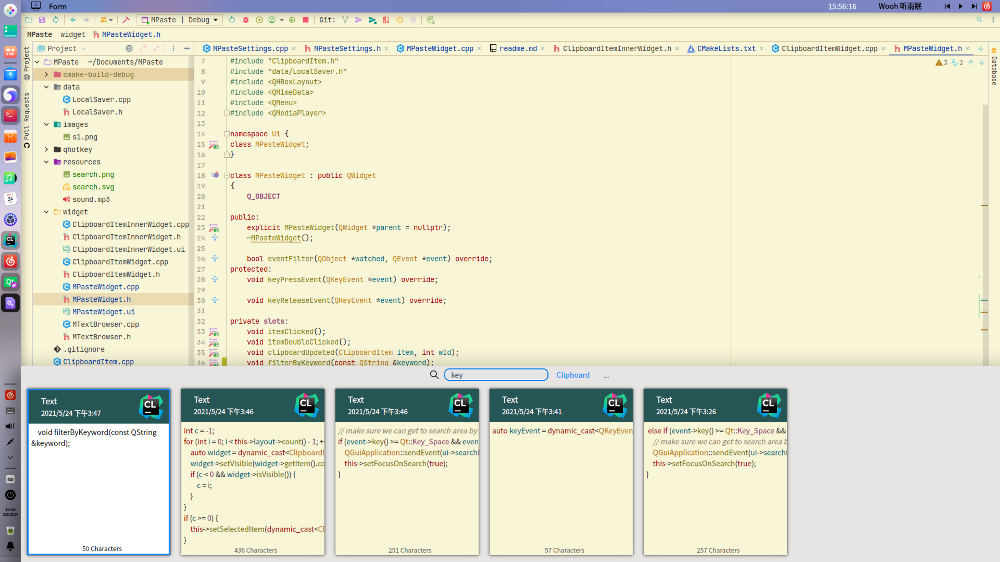

# MPaste

A clipboard manager for Linux. Works on X11 and Wayland.

> It has nothing related to `Paste` for mac. I just like its UX design, and decide to implement one in Qt

> Still working in progress

## Feature

* Clipboard history saved to files
* More elegant UI design
* History search

## Shortcut

* `ctrl-alt-q`: show/hide window (Only works on X11 now)
* `Alt+[1-9, 0]`: quick select item. Holding `Alt` can show the shortcut tips
* Any characters: search mode

> Global shortcut doesn't work on Wayland now

> On Gnome wayland with 2x screen factor, `export QT_AUTO_SCREEN_SCALE_FACTOR=1` is needed before running.

## Default settings

* Global shortcut: `ctrl-alt-q`
* Max history size: 500
* History location: `~/.MPaste`

## Screenshot

Gif on [Imgur](https://i.imgur.com/79gyO0n.gifv)




## How to bulid from source

```shell
sudo apt install cmake g++ make libkf5windowsystem-dev qttools5-dev libqt5x11extras5-dev qtmultimedia5-dev libgsettings-qt-dev
git clone https://github.com/SeptemberHX/MPaste
cd MPaste
mkdir build
cd build
cmake ..
make
```

* [QHotKey](https://github.com/Skycoder42/QHotkey.git)
* sound effect from https://www.zapsplat.com/

<div>Icons made by <a href="https://www.flaticon.com/authors/pixel-perfect" title="Pixel perfect">Pixel perfect</a> from <a href="https://www.flaticon.com/" title="Flaticon">www.flaticon.com</a></div>

## Todo

* Use image instead of widget in scroll area to speed up
* Categories
