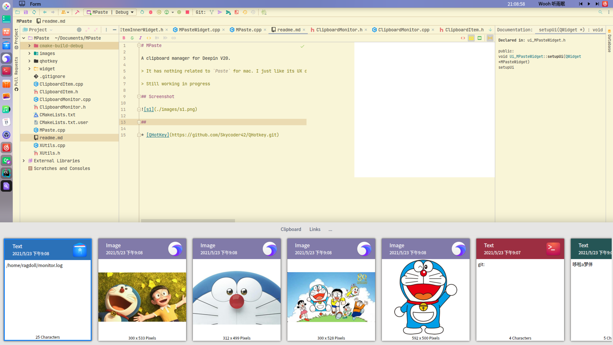

# MPaste

A clipboard manager for Deepin V20.

> It has nothing related to `Paste` for mac. I just like its UX design, and decide to implement one in Qt

> Still working in progress

## Feature

* Clipboard history saved to files
* More elegant UI design
* History search

## Shortcut

* `ctrl-alt-q`: show/hide window
* `Alt+[1-9, 0]`: quick select item. Holding `Alt` can show the shortcut tips
* Any characters: search mode

## Default settings

* Global shortcut: `ctrl-alt-q`
* Max history size: 500
* History location: `~/.MPaste`

## Screenshot

##

* [QHotKey](https://github.com/Skycoder42/QHotkey.git)
* sound effect from https://www.zapsplat.com/

Icons made by <a href="https://www.flaticon.com/authors/pixel-perfect" title="Pixel perfect">Pixel perfect</a> from <a href="https://www.flaticon.com/" title="Flaticon">www.flaticon.com</a>

## Todo

* Use image instead of widget in scroll area to speed up
* Categories
