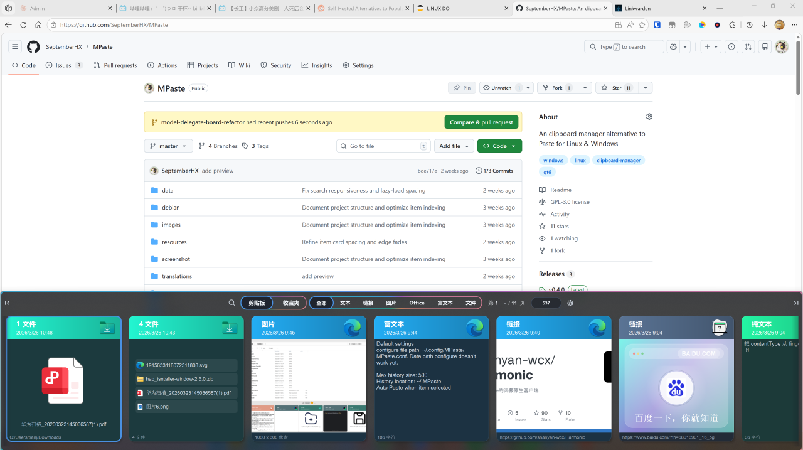

# MPaste

<!--
input: 依赖仓库结构、维护规范与对外说明的真实状态。
output: 对外提供根目录级说明、规则与文件清单。
pos: 仓库级主文档与维护约束入口。
update: 一旦我被更新，务必更新我的开头注释，以及所属的文件夹的 README.md。
-->

## Documentation Discipline
- 任何功能、架构、写法更新，必须在工作结束后同步更新相关目录的 `README.md` 与被改文件的开头注释。
- 任何新增、删除、移动文件的操作，必须同步修正对应文件夹的文件清单与职责说明。
- 二进制资源与法律/格式强约束文件以目录 README 为准，不强行插入会破坏格式的头注释。

## Root Architecture
- 定位：根目录承载启动入口、构建配置、资源索引与仓库级说明。
- 依赖：Qt 工具链、各子目录实现与平台打包配置。
- 输出：应用启动入口、构建入口与维护规范。

## Root Files
- `.gitignore`: 地位=忽略规则；功能=定义仓库不纳入版本管理的文件模式。
- `CMakeLists.txt`: 地位=主构建入口；功能=定义全项目构建图、依赖与打包开关。
- `CMakeLists.txt.user`: 地位=本地工程配置；功能=保存 CMakeLists.txt.user 对应的 Qt Creator 本地工程状态。
- `CMakeLists.txt.user.92dd5e2.4.9-pre1`: 地位=本地工程配置；功能=保存 CMakeLists.txt.user.92dd5e2.4.9-pre1 对应的 Qt Creator 本地工程状态。
- `deb.cmake`: 地位=打包辅助脚本；功能=补充 Debian/CPack 打包配置。
- `LICENSE`: 地位=许可证文本；功能=声明项目授权与法律边界。
- `MPaste.cpp`: 地位=程序入口；功能=启动应用、配置运行环境并拉起主窗口。
- `MPaste.desktop`: 地位=桌面入口清单；功能=描述 Linux 桌面环境中的启动方式与图标。
- `readme.md`: 地位=主说明；功能=提供仓库级说明、维护规则与根目录清单。
- `resources.qrc`: 地位=资源索引；功能=注册 Qt 资源系统中的静态资源路径。

A clipboard manager alternative to Paste for Linux & Windows.

> It has nothing related to `Paste` for mac. I just like its UX design, and decide to implement one in Qt

> For wayland, it cannot get the icons of current window, which is treated as the provider of current clipboard data. I haven't found how to fetch the window icon under wayland with window id. Check PlatformRelated.h for more details.

## Feature

* Clipboard history saved to files
* More elegant UI design
* History search
* auto paste
* Paste selected item as plain text

## Shortcut

* `Alt+[1-9, 0]`: quick select and paste item. Holding `Alt` can show the shortcut tips
* `Alt+Shift+[1-9, 0]`: quick select and paste item as plain text
* `Ctrl+Enter`: paste the currently selected item as plain text
* Any characters: search mode
* Global shortcut to show window: Open your shortcut settings in system settings, and assign a shortcut for command `/path/to/your/MPaste`

> On Gnome, please install the extension: https://extensions.gnome.org/extension/1005/focus-my-window/  
> Or the window will not get focused after appearing with shortcut

## Default settings

> configure file path: `~/.config/MPaste/MPaste.conf`. Data path configure doesn't work yet.

* Max history size: 500
* History location: `~/.MPaste`
* Auto Paste when item selected

## Screenshot

Gif on [Imgur](https://i.imgur.com/79gyO0n.gifv)

### Windows 11



### Linux


## For Deepin V20

Download the deb package from the release page and install it.

**do not forget to set a shortcut for it in system settings**

## How to bulid from source

```shell
sudo apt install cmake g++ make libkf5windowsystem-dev qttools5-dev libqt5x11extras5-dev qtmultimedia5-dev libgsettings-qt-dev
git clone https://github.com/SeptemberHX/MPaste
cd MPaste
mkdir build
cd build
cmake ..
make -j8
```

### Build configuration notes

On Windows, the project no longer hardcodes local Qt / MinGW paths.

- Optional Qt prefix: `-DMPASTE_QT_ROOT=/path/to/Qt/6.x.x/<toolchain>`
- Optional MinGW runtime directory: `-DMPASTE_MINGW_BIN_DIR=/path/to/mingw/bin`
- Disable post-build Windows packaging: `-DMPASTE_ENABLE_WINDOWS_DEPLOY=OFF`

Example:

```shell
cmake -B build -DMPASTE_QT_ROOT=C:/Qt/6.8.0/mingw_64
cmake --build build
```

### Rendering backend

You can optionally control the OpenGL backend with the `MPASTE_OPENGL_BACKEND` environment variable:

- `auto`: do not force a backend
- `gles`: force OpenGL ES
- `software`: force software OpenGL
- `software-gles`: keep the previous compatibility behavior

Example:

```shell
set MPASTE_OPENGL_BACKEND=software
MPaste.exe
```

### History file compatibility

- New history files use a versioned on-disk format.
- Older `.mpaste` files are still loaded automatically.
- Invalid / corrupted history files are skipped instead of breaking the whole load process.

* [KDSingleApplication](https://github.com/KDAB/KDSingleApplication)
* sound effect from https://www.zapsplat.com/

<div>Icons made by <a href="https://www.flaticon.com/authors/pixel-perfect" title="Pixel perfect">Pixel perfect</a> from <a href="https://www.flaticon.com/" title="Flaticon">www.flaticon.com</a></div>

## Todo

* Use image instead of widget in scroll area to speed up
* Categories
