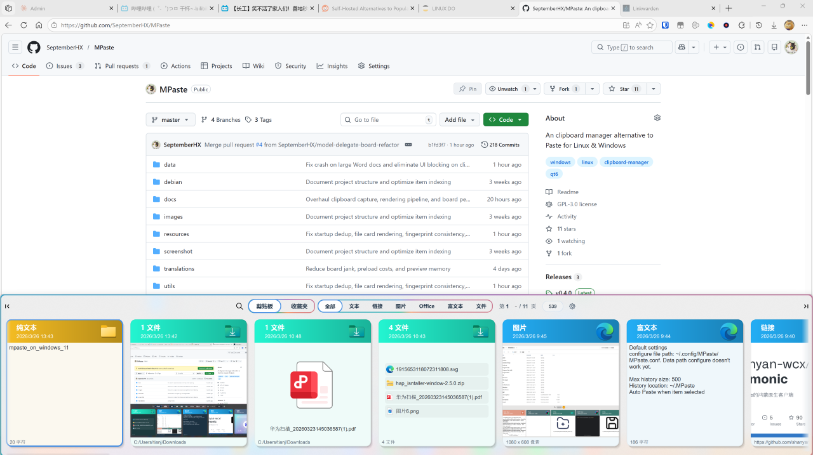

# MPaste

A modern clipboard manager for **Windows** and **Linux**, inspired by [Paste](https://pasteapp.io/) for macOS.

> MPaste has no affiliation with Paste for Mac. I just like its UX design and decided to build one in Qt.

Light mode:



Dark mode:


## Features

- **Clipboard history** — automatically captures text, links, images, rich text, files, colors, and Office content
- **Card-based UI** — each clipboard item rendered as a visual card with icon, thumbnail, and metadata
- **Boards** — "Clipboard" for live history, "Starred" for favorites; pin or star items independently
- **Search & filter** — type to search, filter by content type
- **Quick paste** — `Alt+[1-9, 0]` to paste by position; `Ctrl+Enter` or `Alt+Shift+[1-9, 0]` to paste as plain text
- **Space preview** — press `Space` to open a large, zoomable preview of the selected item
- **Dark / Light / System theme** — full theme support with smooth switching
- **Auto paste** — optionally paste immediately on item selection
- **Persistent history** — clipboard items saved to disk in `.mpaste v4` format with embedded thumbnails
- **Link preview** — fetches OpenGraph metadata and favicons for URL items
- **Multi-select** — `Ctrl`/`Shift` click to select multiple items for bulk favorite or delete
- **Configurable retention** — auto-cleanup history by days, weeks, or months
- **Global hotkey** — assign a system shortcut to toggle the MPaste window

## Keyboard Shortcuts

| Shortcut | Action |
|---|---|
| `Alt+[1-9, 0]` | Quick select and paste |
| `Alt+Shift+[1-9, 0]` | Quick select and paste as plain text |
| `Ctrl+Enter` | Paste selected item as plain text |
| `Space` | Toggle preview |
| `Left` / `Right` | Navigate items |
| `Tab` | Switch boards |
| Any character | Enter search mode |

Hold `Alt` to show shortcut hints on cards.

## Platform Notes

### Windows

- Global hotkey uses `Alt`-based toggle with Office/WPS ribbon-keytip avoidance
- Paste injection via simulated keypress (`Ctrl+V`, `Shift+Insert`, etc.)

### Linux

- X11 support with `xdotool` integration
- Wayland: window icons cannot be fetched (see `PlatformRelated.h`)
- On GNOME, install [Focus My Window](https://extensions.gnome.org/extension/1005/focus-my-window/) for proper focus after hotkey activation
- Deepin V20: download `.deb` from the release page

## Configuration

Config file: `~/.config/MPaste/MPaste.conf`

| Setting | Default |
|---|---|
| Max history size | 500 |
| History location | `~/.MPaste` |
| Auto paste | On |

## Build from Source

### Requirements

- C++17 compiler
- CMake 3.7+
- Qt 6 (Widgets, Multimedia, Network, Xml)

### Linux

```shell
sudo apt install cmake g++ make libkf5windowsystem-dev qttools5-dev libqt5x11extras5-dev qtmultimedia5-dev libgsettings-qt-dev
git clone https://github.com/SeptemberHX/MPaste
cd MPaste
mkdir build && cd build
cmake ..
make -j8
```

### Windows

```shell
cmake -B build -DMPASTE_QT_ROOT=C:/Qt/6.8.0/mingw_64
cmake --build build
```

Optional CMake flags:

| Flag | Description |
|---|---|
| `-DMPASTE_QT_ROOT=<path>` | Qt installation prefix |
| `-DMPASTE_MINGW_BIN_DIR=<path>` | MinGW runtime directory |
| `-DMPASTE_ENABLE_WINDOWS_DEPLOY=OFF` | Disable post-build packaging |

### Rendering Backend

Control the OpenGL backend via `MPASTE_OPENGL_BACKEND` environment variable:

| Value | Behavior |
|---|---|
| `auto` | System default |
| `gles` | Force OpenGL ES |
| `software` | Force software rendering |

## Credits

- [KDSingleApplication](https://github.com/KDAB/KDSingleApplication)
- Sound effects from [Zapsplat](https://www.zapsplat.com/)
- Icons by [Pixel Perfect](https://www.flaticon.com/authors/pixel-perfect) from [Flaticon](https://www.flaticon.com/)

## License

[GPLv3](LICENSE)
