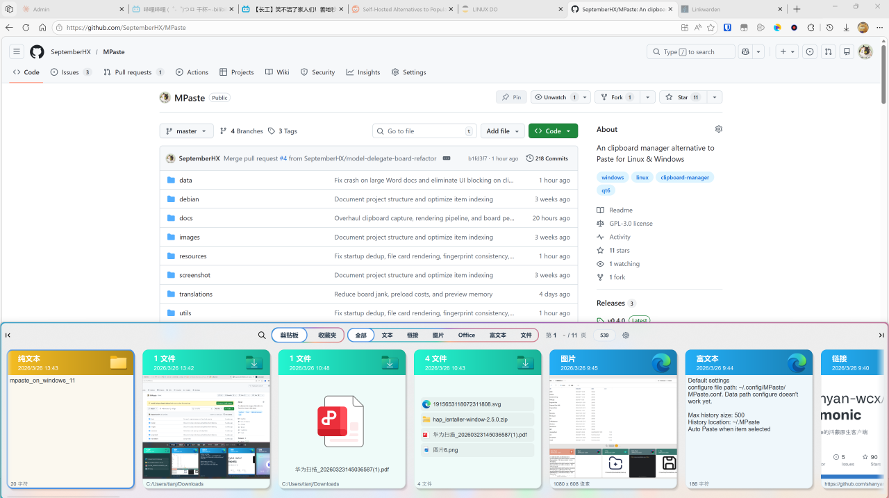
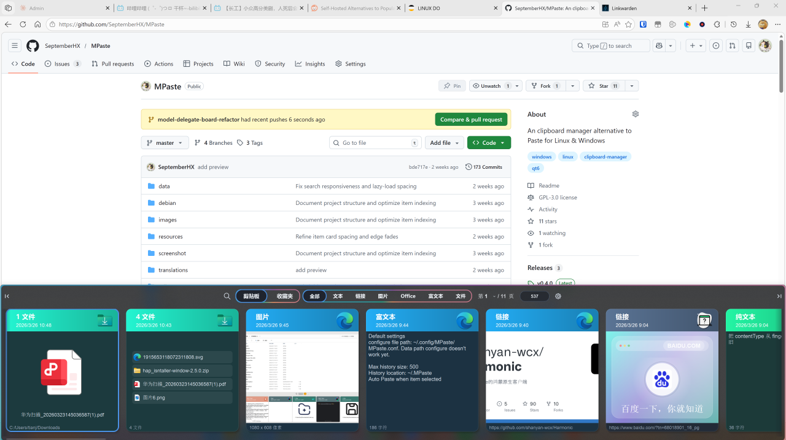

# MPaste

A modern clipboard manager for Windows and Linux, inspired by [Paste](https://pasteapp.io/) for macOS.

> MPaste has no affiliation with Paste for Mac. It is a Qt implementation inspired by that workflow and visual style.

Light mode:



Dark mode:



## Features

- Clipboard history for text, links, rich text, images, files, colors, and Office clipboard payloads.
- Card-based browsing with thumbnails, app icons, favicons, and metadata.
- Separate clipboard and favorites boards, with independent pinning and favoriting.
- Keyword search and content-type filters.
- Paged and continuous history browsing modes.
- Quick paste shortcuts: `Alt+[1-9, 0]` to paste by visible position.
- Plain-text paste shortcuts: `Ctrl+Enter` for the current selection, or `Alt+Shift+[1-9, 0]` for quick slots.
- Large preview dialog on `Space`, with zoom support for image previews.
- Detailed inspector dialog for viewing normalized content and raw MIME data.
- Alias rename, pin-to-top, multi-select, batch favorite/unfavorite, and batch delete actions.
- Export selected items to image, HTML, or text files when supported.
- Link preview fetching with OpenGraph metadata, preview images, and favicons.
- Persistent history stored in `.mpaste` files with embedded preview thumbnails.
- Current on-disk format is `.mpaste v6`; older v4/v5 files are still readable.
- Configurable history retention, max history size, item scale, theme mode, sound, and paste shortcut mode.
- Configurable global hotkey and optional auto-paste on selection.
- Optional external sync folder watching with incremental reloads.

## Keyboard Shortcuts

| Shortcut | Action |
|---|---|
| `Alt+[1-9, 0]` | Quick select and paste |
| `Alt+Shift+[1-9, 0]` | Quick select and paste as plain text |
| `Ctrl+Enter` | Paste current selection as plain text |
| `Space` | Open or close preview |
| `Left` / `Right` | Move selection |
| `Home` / `End` | Jump to start or end |
| `Tab` | Switch boards |
| Any printable character | Start search |

Hold `Alt` to show shortcut hints on visible cards.

## Platform Notes

### Windows

- Default global hotkey is `Alt+Q`, but it is configurable in settings.
- Alt-based hotkeys have extra handling to avoid ribbon keytip conflicts in Office and WPS.
- Paste injection supports multiple modes, including `Ctrl+V`, `Shift+Insert`, `Ctrl+Shift+V`, and `Alt+Insert`.
- Explorer integration can reveal copied files from the item context menu.

### Linux

- Linux support currently targets X11.
- Build/runtime integration depends on X11, `xcb-keysyms`, `xdo` / `xdotool`, and `gsettings-qt`.
- Wayland support is limited; window icon lookup and some focus/paste behaviors may not work as expected.
- On GNOME, [Focus My Window](https://extensions.gnome.org/extension/1005/focus-my-window/) can improve focus restoration after the global hotkey.
- Deepin V20 users can use the packaged `.deb` from the releases page.

## Configuration

MPaste uses `QSettings` for application preferences.

- Linux typically stores settings in `~/.config/MPaste/MPaste.conf`.
- Windows typically stores settings under `HKEY_CURRENT_USER\Software\MPaste\MPaste`.
- Clipboard history is stored separately under the configured save folder, which defaults to `~/.MPaste`.

Default settings:

| Setting | Default |
|---|---|
| Max history size | `500` |
| Retention policy | `30 days` |
| History save folder | `~/.MPaste` |
| Auto paste | `On` |
| Paste shortcut mode | `Auto` |
| Theme | `Dark` |
| History view mode | `Paged` |
| Item scale | `100%` |
| Copy sound | `On` |
| Global hotkey | `Alt+Q` |

## Build from Source

### Requirements

- C++17 compiler
- CMake 3.7+
- Qt 6 with `Widgets`, `Multimedia`, `Network`, `Xml`, and `LinguistTools`

Linux builds also require:

- `pkg-config`
- X11 development headers/libraries
- `xcb-keysyms`
- `xdo` / `libxdo`
- `gsettings-qt`

Package names vary by distro. Install the Qt 6 development packages plus the libraries above before configuring the project.

### Linux

```sh
git clone https://github.com/SeptemberHX/MPaste
cd MPaste
cmake -B build
cmake --build build -j8
```

### Windows

```sh
cmake -B build -DMPASTE_QT_ROOT=C:/Qt/6.8.0/mingw_64
cmake --build build
```

Optional CMake flags:

| Flag | Description |
|---|---|
| `-DMPASTE_QT_ROOT=<path>` | Qt installation prefix |
| `-DMPASTE_MINGW_BIN_DIR=<path>` | MinGW runtime directory used for Windows deployment |
| `-DMPASTE_ENABLE_WINDOWS_DEPLOY=OFF` | Disable post-build Windows deployment packaging |

### Rendering Backend

You can control the OpenGL backend with the `MPASTE_OPENGL_BACKEND` environment variable:

| Value | Behavior |
|---|---|
| `auto` | System default |
| `gles` | Force OpenGL ES |
| `software` | Force software rendering |
| `software-gles` | Force OpenGL ES with software fallback attributes |

## Credits

- [KDSingleApplication](https://github.com/KDAB/KDSingleApplication)
- Sound effects from [Zapsplat](https://www.zapsplat.com/)
- Icons by [Pixel Perfect](https://www.flaticon.com/authors/pixel-perfect) from [Flaticon](https://www.flaticon.com/)

## License

[GPLv3](LICENSE)
